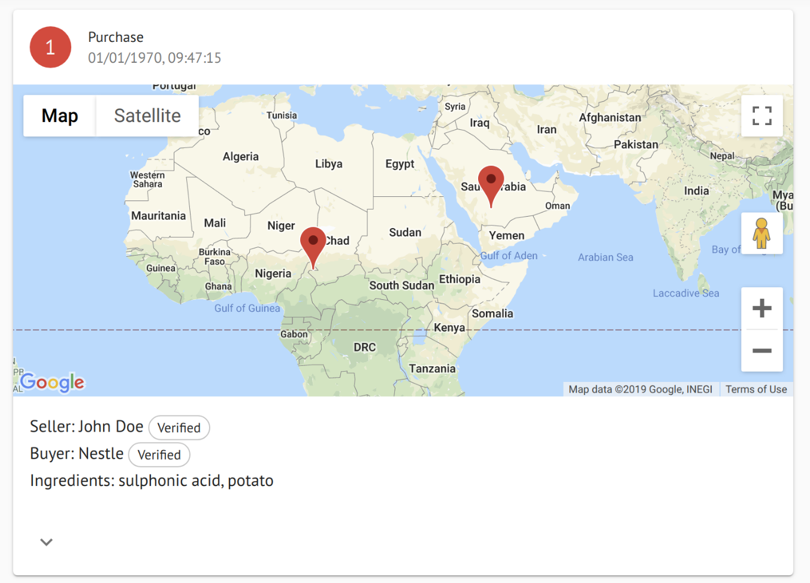
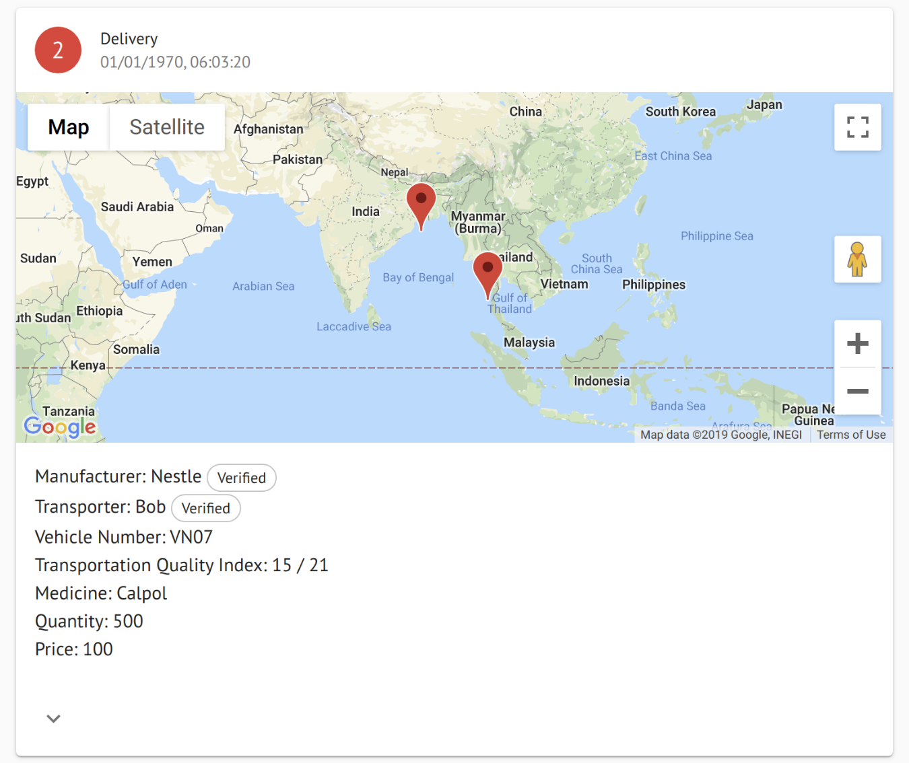
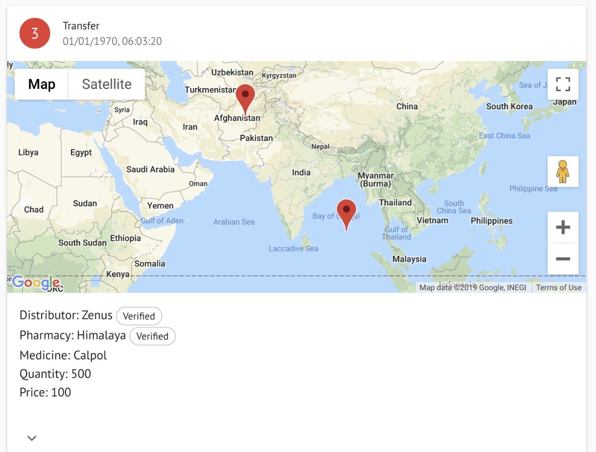

# pharmaceutical-supply-chain

Pharmaceutical Supply Chain based on Algorand Blockchain.

## System Structure and Flow

### Actors

- Farmers
- Manufacturers
- Transporters
- Distributors
- Pharmacies
- Patients

### Interactions

#### Purchase

Farmer will send raw materials to Manufacturer. Multiple farmers can send different raw materials to a manufacturer for a particular medicine.



```json
{
    "seller": {
      "name": "",
      "age": 0,
      "location": {
        "lat": "",
        "lng": ""
      }
    },
    "buyer": {
      "name": "",
      "location": {
        "lat": "",
        "lng": ""
      }
    },
    "timestamp": "",
    "ingredients": [
      {
        "name": "",
        "quantity": "",
        "price": 0
      },
      {
        "name": "",
        "quantity": "",
        "price": 0
      }
    ]
}
```

A `farmerManufacture` multisig account will be created which will be signed by farmer once he send the ingredients and then manufacture can confirm it and release funds to the farmer.

After this manufacture will prepare medicine and then divide it among batches, each batch will be an account with `batchId` as it's account address. Manufacture will send each batch a tx with a note like this template:
```json
{
  "name": "Purchase",
  "proof": txID
}
```
`proof` is the txId of transaction between farmer and manufacture.
#### Delivery

Manufactures the medicines and sends the medicines to different distributors via transporters.



```json
{
  "manufacturer": {
    "name": "",
    "location": {
      "lat": 0,
      "lng": 0
    }
  },
  "transporter": {
    "name": "",
    "vehicleNo": "",
    "tempSensor": {
      "ideal": 0, // in celsius
      "crossed" : 0
    }
  },
  "timestamp": 3232323,
  "distributor": {
    "name": "",
    "location": {
      "lat": 0,
      "lng": 0
    }
  },
  "ingredientSource": "",
  "medicines": {
    "quantity": 0,
    "name": "",
    "price": 0,
    "batchId": ""
    }
  }
}
```

Again a three way multisig will be created between transporter. distributor and manufacturer. First manufacture will sign, then transporter after he completes the delivery and in the end distributor will sign to release the funds to manufacturer from him.

The truck has a IOT sensor within it which automatically increment a value if temp exceeds the `ideal` value. The duration of temp above than ideal value is used to calculate `score` for the medicine. 
`score = 10 * (1 - crossed / 240)` On avg it should take 240 minutes to reach destination. Now the distributor will send a tx to the batchId of medicine with the same template as manufacture did with just one extra field, `score`.

_Note that if `score < 7` then distributor will have to reject the batch_

#### Transferring 

Distributor transfers the medicine to pharmacies.



```json
{
    "distributor": {
      "name": "",
      "location": {
        "lat": "",
        "lng": ""
      }
    },
    "medicines": [
      {
        "name": "",
        "quantity": 0,
        "price": 0,
        "id": medicineBatch.addr
      }
    ],
    "pharmacy": {
      "name": "",
      "location": {
        "lat": "",
        "lng": ""
      }
    },
    "source": deliverId,
    "timestamp": ''
}
```
Pharmacies will send a tx with `transfer` note to the batchID.

#### Buying Medicine

Patients will go to pharmacies to buy medicines. Before buying they can see the `batchId` written on top of medicine and then they can just enter that id in our explorer to get the complete history of that medicine starting from it's ingredients. He'll also be able to see the score by distributor.

```json
{
  "name": "",
  "proof": "",
  "score": 0, (Conditional Parameter)
```

## Portal UI/UX

### Features

- Anyone with the unique identifier of a batch should be able to view the current status of a particular batch.
  - If the retailer wants to verify that the medicine was from a authorized manufacturer and that the distributor brought it in proper conditions, he can view that by searching the batch serial (unique identifier of a batch)
  - If a patient wants to verify the same, even he can do that in the same way.
- Any actor should be able to emit events of the structures mentioned above once they are satisfied with the previous progress and takes up their task.
  - In the case of the distributor this will be handled by an IoT device (temperature sensor fitted with camera?)
